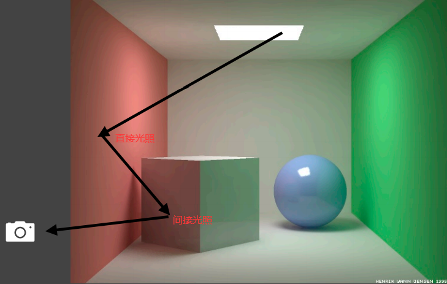
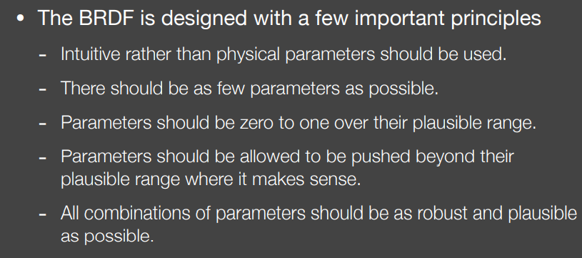

# 实时阴影

## Shadow Mapping

### 基本特征

2pass算法：pass1由光源处生成SM；pass2由相机使用SM。

图像空间算法：无需场景中几何信息，但存在自遮挡（self occlusion）和走样（aliasing）。

### 算法流程

pass1中从光源处生成SM（即一张深度纹理）。

pass2中从人眼处正常渲染图像，并将可见点投影回光源视角下，若该点深度值大于SM中的深度值，则构成遮挡，生成阴影。

### 存在的问题

#### 自遮挡（Self occlusion）

自遮挡的问题会造成下图中无阴影区域的奇怪花纹。

自遮挡形成的原因如下图所示，在光源视角下，SM中一个像素覆盖区域均为相同深度值(可理解为该像素区域是与光源垂直的平面)，而在人眼视角中，区域中某一点深度（投影到光源视角下）会略低于SM中对应的深度，形成遮挡。

为了解决该问题，可以尝试增加一个偏移量（阈值），当深度差低于该值时，不认为形成遮挡。

但该方法可能导致当遮挡物与阴影接受面距离较近时，丢失阴影，使阴影间断，如下图中鞋跟处阴影被忽略。

#### 走样（Aliasing）

因为SM有一定分辨率，分辨率较低时会出现走样问题，如下图。

## Percentage Closer Filtering (PCF)

原本用于阴影的抗锯齿，即对SM中深度比较结果的滤波，后来也被用于软阴影的生成（PCSS）

并不是对SM的滤波，因为模糊后的SM在进行深度比较后，得到的结果依然是非0即1的。

滤波尺寸较小则阴影锐利，较大则阴影柔和。

### 方法

每个像素进行多次深度比较，取比较结果的平均值。

例如下图中，针对P点，则取周围一系列点（比如说3$\times$3）进行深度比较,假如得到的结果为，则取均值后，可见度（visibility)为0.667。

## Percentage Closer Soft Shadows（PCSS）

PCSS是利用PCF来实现软阴影。

下图中，在遮挡物距离近时，阴影锐利，遮挡物距离远时，阴影柔和。（忽略图中的镜头失焦）

如下图，利用相似三角形可计算出半影（Penumbra）大小（这也决定了PCF中滤波大小，因为滤波大小决定阴影柔和程度）。

### 算法

step1-Blocker search：在SM上一定的区域内进行遮挡物的搜索，计算平均的遮挡距离

step2-Penumbra estimation：利用平均遮挡距离决定滤波大小

step3-Percentage Closer Filtering：根据滤波大小，进行PCF

### 遮挡物搜索区域的确定

关键问题是在SM上确定一个区域进行遮挡物的搜索，如下图所示，红色区域即为可能出现遮挡的区域，可知搜索区域大小应与面光源大小和接受面距离相关（光源大则搜索区域大，接受面距离大则搜索区域大）

## Variance Soft Shadow Mapping（VSSM）

在PCSS算法中，step1和step3是较慢的，因为在遮挡物搜索和PCF中都涉及到SM上某个区域内所有像素的遍历，而VSSM着重于加速这个过程。

### 加速PCF

目标是求得在SM上滤波范围内有多少比例的像素的深度值小于着色点深度值（构成遮挡）

将SM上的深度值的分布近似为正态分布

正态分布的均值可利用Hardware MIPMAPing或Summed Area Tables (SAT)确定

正态分布的方差利用公式$Var(X)=E(X^2)-E^2(X)$确定（mipmap中存储深度值的平方即可求得$E(X^2)$）

得到正态分布后，目标转化为根据确定的着色点深度值x，求正态分布上CDF(x)的值（CDF为概率的累积分布函数）

通过CDF可得精确解，但事实上利用Chebychev不等式可以进一步近似（甚至不需要是正态分布）。

### 加速blocker search

目标是求搜索区域中遮挡物的平均距离。假设搜索区域内的深度值如下图

设着色点深度值为t，蓝色部分深度值小于t，构成遮挡，其均值记为$z_{occ}$，为所求目标

红色部分深度值大于t，不构成遮挡，其均值记为$z_{unocc}$，总体深度值记为$z_{Avg}$

则有

N表示像素个数，其中$N1/N=P(x>t)$，用正态分布和Chebychev不等式近似求解（类似于加速PCF中的做法），再用1减求得$N2/N$。

为了快速求得$z_{unocc}$，近似为t（阴影接受面大多为平面，近似较为合理）

$z_{Avg}$也可由mipmap快速求得

回顾等式关系，可求剩下的$z_{occ}$。

###  存在的问题

若真实分布与正态分布相差较大，则拟合不准确

可能会出现个别地方过亮或过暗，突出的一种表现为漏光（Light leaking）现象

## 加速求得方形范围内的均值（rectangular range query）

### MIPMAP

### Summed Area Table（SAT）

SAT是一种经典的数据结构，可以快速求得区域内的和（求得和则均值易求）

一维情况下如下图（前缀和）

二维情况下（每一点存储向左上方包围的方形面积，而区域内任意方形面积可利用四个顶点代表的包围面积加加减减求得）

## Distance Field Soft Shadows

### 距离场定义

距离场函数定义：对于空间中任意一点，函数值为该点与场景中任意物体的最近距离（可带符号，因此也被叫做signed distance function，SDF）

### 距离场的使用

#### Ray marching

可用来进行Ray marching（光线以一定步长行进），原理在于SDF的值可被理解为安全行进距离（从某点到场景中任意物体的最近距离内不存在其他物体），每次以光线当前位置的SDF值为下次行进距离。

#### 估计遮挡比例

SDF的值还可理解为周围球形范围内无遮挡物，在人眼视角下构成一个无遮挡的“安全角”，注意在该点安全角内，较近距离处仍可能存在遮挡，最终安全角计算需要利用ray marching，见下文。

### 利用距离场实现软阴影

利用ray marching计算最终安全角，方法是每行进一步计算当前安全角，取最小值作为最终安全角。

安全角小则可见度（visibility）小，利用上图中线圆相切关系，可知安全角为，但由于arcsin计算开销大，改为，其中k越大意味着半影（penumbra) 越小，如下图

原因在于k越大，代表可见度的值在0到1之间的变化越快，使阴影锐利

### 优势与劣势

运行时快速且高质量，但距离场需要预计算且存储占用大。

# 实时环境光照

环境光用一张图像表示，每个像素颜色代表从该方向来的无限远处的光。

图像可能是Spherical map或cube map的形式

环境光照也被叫做基于图像的光照Image-Based Lighting (IBL)

利用环境光照着色（不考虑阴影）本质是求解渲染方程

一般的着色方法是利用Monte Carlo方法求解积分的数值解，需要大量采样。

该方法的问题在于采样开销大，速度慢。

## The Split Sum

### 光照项预计算

对于渲染方程中的BRDF函数$f_r$来说，若BRDF光滑（glossy），则积分区域小，若BRDF粗糙（diffuse），则函数平滑

积分区域小和函数平滑两个特点使以下近似更加准确

由此对渲染方程进行近似，提取出光照项，如下

提取出光照项所对应的实际做法是对环境光照图像进行提前滤波（Prefiltering）

滤波后的环境光照图像在光的镜面反射方向上直接得到原环境光照中BRDF积分区域内的光照均值，对应于近似后的渲染方程中的光照项

### BRDF项预计算

基于微表面理论的BRDF形式如下

其中， Schlick近似的Fresnel项如下，需要R0（基础颜色）和cos（入射方向和出射方向的半夹角，即微表面理论中，入射方向和微表面法向的夹角）两个参数

Beckmann分布的NDF项如下，需要$\alpha$（粗糙度）和cos两个参数

课程ppt中未提及，推测几何遮蔽项G仅需要cos参数

BRDF项可以提取出F项中的基础颜色R0，如下

综上，余下的积分项可进行预计算，结果存储为仅需粗糙度和cos夹角两个参数的纹理

### 结果

避免采样，得到快速且准确的结果

## 来自环境光照的阴影

目前实时渲染中很难做到

若视为多光源问题，则阴影贴图SM的开销正比于光源数量

若视为采样问题，则可见项V较为复杂

工业界解决方案为选择最明亮的几个光源生成阴影

相关的其他研究如下

## Spherical Harmonics

基函数（Basis Functions）是一系列可以通过线性组合来拟合其他函数的函数，形式一般如下

球谐函数则是定义在球面上的一系列二维基函数

可视化后如下

l轴代表阶数，高阶的函数可以表达高频信息

m轴代表某一阶的函数个数

每个SH球谐函数与勒让德（Legendre）多项式有关（暂未研究其数学形式）。

用SH基函数$B_i(\omega)$拟合函数$f(\omega)$时，获得参数的方式（投影）如下

用SH拟合diffuse BRDF时，,SH参数在l>3时，参数平均值趋近于0，表明只需要3阶以内的SH函数即可较好拟合（diffuse BRDF以低频信息为主）

## Precomputed Radiance Transfer(PRT)

### diffuse

将渲染方程的积分项分为light和transport两部分，如下（蓝色为light，橙色为transport）

分别用SH拟合，diffuse情况下，T项中的BRDF项与$\omega_o$无关

注意基函数中的正交（orthonormal）性质

利用正交性质，用SH拟合的Light项与Transport项相乘等价于参数向量点乘，结果为固定值。

实践中，环境贴图即light项，模型上每一个顶点需要计算其transport项，预计算过程中得到对应SH参数，运行时只需进行点乘操作。

### Glossy

glossy情况下，Transport项中的BRDF与$\omega_o$（人眼看去的方向）有关，因此包含$\omega_i,\omega_o$共四维。先进行一次SH映射，则参数中含有$\omega_o$的函数，之后再次进行SH映射得到最终的反射结果

反射结果（即$L(o)$）也是SH函数的线性组合，保存其参数向量

# 实时全局光照

全局光照=直接光照+间接光照

直接光照是由光源直接照亮

间接光照是由其他物体表面反射的光照亮

实时渲染中，全局光照一般只解决一次反射的间接光照

## Reflective Shadow Maps (RSM)

### 确定次级光源

首先由经典的shadow map得到光源直接点亮的表面片，作为次级光源（shadow map上每一个像素都是一个表面片patch）

### 计算次级光源贡献

q点为次级光源位置，p点为被照亮的着色点，$\mathrm dA $为像素覆盖的表面片面积，$\mathrm d\omega$为$\mathrm dA $覆盖的立体角。

q对p的光照贡献为对立体角的积分，可转化为表面面积的积分，如上图中公式所示

转化为对表面积的积分后，对应渲染方程的推导如下

渲染方程中$L_i$是q到p的radiance，$V$暂不考虑，假设无遮挡关系（若对每个次级光源考虑对每个着色点的可见性开销太大），$f_r$为着色点的BRDF，可为任意类型（只假设q处为diffuse）

着重考虑$L_i$项，即q点出射的radiance，此处BRDF为diffuse，可得如下关系

$\frac{\phi}{\mathrm dA}$为q点irradiance，乘以BRDF得出射radiance即$L_i$，将$L_i$代入原渲染方程，$\mathrm dA$抵消，剩下BRDF与$\phi$相乘，BRDF为常值，$\phi$由光源决定，在生成shadow map时可储存

并非所有的次级光源都产生贡献，比如被遮挡的（此处暂不考虑）和世界坐标下距离较远的

可以大胆假设在shadow map上距离着色点较远的像素在世界坐标下也距离较远，之后可以通过shadow map上的采样来决定产生贡献的像素（具体采样方法未详细介绍）

下图为需要保存的数据

### 优势与劣势

优势：

便于实现

劣势：

开销线性相关于光源数

没有间接光照的可见性检测

过多假设，如次级光源为diffuse的表面，shadow map为深度信息却被认为表示距离远近

采样的速度及质量的两难问题

## Light Propagation Volumes  (LPV)

主要思想是将场景划分为三维网格，在网格中计算间接光的传播

### 算法流程

#### step1：生成次级光源

利用RSM即可找到被光源直接点亮的表面，作为次级光源

#### step2：注入次级光源

将场景划分为三维网格

对每一网格，计算所包围的次级光源向各个方向发出的radiance，整体投影到球谐函数SH进行拟合，视为该网格包含的radiance

#### step3：传播

对每个网格，收集从周围六个面传播来的radiance

收集的radiance同样用SH拟合

重复上述过程直到收敛

#### step4：渲染着色点

确定着色点所在的网格

利用该网格所保存的radiance进行着色

### 可能出现的问题

在step4中，当物体的几何尺度小于网格大小，则会出现网格内部的几何遮挡，即本应被遮蔽的间接光依然被视作可以照亮同网格内的着色点。

这个问题会导致漏光现象（Light leaking），如下图中的屋檐下方

## Voxel Global Illumination  (VXGI)

将整个场景体素化（Voxelize）并且建立层级结构（hierarchy）

### 算法流程

#### pass1 光源视角下

存储每个体素的入射方向分布和法线方向分布（应当还有入射的radiance），并更新层级结构

#### pass2 相机视角下

对glossy的表面，往反射方向追踪一个圆锥体（cone）

追踪圆锥体的过程中逐渐增大在层级结构中的查询尺寸

如果是diffuse的表面，可追踪多个圆锥，大体覆盖所有方向，如下图

## Screen Space Ambient Occlusion  (SSAO)

环境光遮蔽（AO）开销小但能强化位置的相对关系

SSAO是对全局光照的一个近似，在屏幕空间中进行

假设间接光照为常数，材质为diffuse

需要考虑着色点处在所有方向上的可见性

受遮蔽少的更亮，受遮蔽多的更暗

### 数学推导

依然从渲染方程开始，利用乘积积分的一个近似方法进行推导

套用近似约等式时，将$cos\theta_i\,\mathrm{d}\omega_i$作为积分变量，得到上图中形式（加入cos目的不明，但使用加入cos的积分变量进行近似时，由于L项和BRDF项均为常数，故该近似实际上是准确的）

$cos\theta_i\,\mathrm{d}\omega_i$的实际意义是立体角在单位圆上的投影，易求得分母下方积分为$\pi$

V项积分变成加权平均，L项积分由于假设间接光照为常数且BRDF为diffuse，推导后依然为常数

更简单直接的推导如下，直接代入常数项即可

### 计算可见性

SSAO中使用深度缓冲（z-buffer）来计算可见性

在球形范围内采样点，在深度缓冲中构成遮挡则视作对着色点构成遮挡（即屏幕空间下，人眼看去被遮挡的采样点被认为对着色点构成遮挡，本质是用易于获得的屏幕空间下的深度缓冲信息近似场景中的几何信息）

由于理论上只有半球面内的遮挡需要考虑，所以整个球体内，当构成遮挡的采样点超过一半时才视为存在环境光遮蔽（不直接使用半球面的原因是可能没有保存法线信息）

用深度信息近似会产生一些错误，如图中红线内的采样点，实际并未造成遮挡

在数学推导中，对可见性的cos加权在此也没有考虑，因此在物理意义也不准确

SSAO用深度信息近似造成错误遮挡的情形如下

选取采样点计算时一些其他注意事项

为了效率使用较少的采样点，由此产生带噪声的结果，进行模糊处理后，也能得到不错的效果

### Horizon based ambient occlusion（HBAO）

同样在屏幕空间下，但需要法线已知，仅在半球面内采样，可以减少一些错误。与SSAO的效果对比如下

## Screen Space Directional Occlusion  (SSDO)

### 基本思想

不再假设间接光照为常数，而是考虑一部分真实的间接光照，但是次级光源在屏幕空间下

基本思想类似于path tracing，如下

在着色点附近，若某方向上存在遮挡，即射线与物体表面相交，则视为接收到交点处反射来的间接光；若某方向上没有遮挡，则视为接收到外部的直接光

基本思想恰好与SSAO相反

SSAO中，着色点附近有遮挡则视为无间接光。两种方法思路相反的根本原因在于SSAO只考虑来自远处的间接光，而SSDO只考虑来自近处的间接光

（个人理解：SSDO只考虑近处的间接光，而间接光本应对近处的着色点有较多贡献，更加合理）

简单的数学描述如下

### 算法简介

与HBAO类似，同样是在已知法线的情况下，在半球面内采样点，采样点到着色点是否存在遮挡由屏幕空间下采样点的可见性决定，被认为到着色点无遮挡的采样点视作无间接光，转而接收该方向上的来自外部的直接光（图左侧）

每个采样点在屏幕空间下对应一个次级光源，被认为到着色点有遮挡的采样点（即屏幕空间下不可见的）对应的次级光源才对着色点有光照贡献，不过当着色点在次级光源面片的法线背面时，光照贡献为0（图中间）

可能存在的问题依然是将屏幕空间的深度信息视作场景中的几何信息可能会出现的错误，比如采样点到着色点实际无遮挡，但因为屏幕空间下不可见而被认为有遮挡；又或者被认为无遮挡的采样点，在该方向远处的直接光实际上是被遮挡的（图右侧）

### 存在的问题

虽然质量不错，但只利用屏幕空间信息会忽略不可见的表面

比如图中，地面上本应有来自黄色表面的间接光照，但在黄色表面逐渐转向不可见的一侧时，因为屏幕空间下对应的次级光源只能是可见的侧面，故不会对原来地面上的位置有光照贡献。这可能也是所有屏幕空间方法的问题

另外一个问题是SSDO只考虑小范围内的间接光

比如图中立方体侧面应该接受来自绿色墙体的间接光，若是SSDO方法则可能不会考虑到较远距离的绿色墙体

## Screen Space Reflection (SSR)

本质是在屏幕空间下做ray tracing

效果如下

用SSR做基本的镜面反射，大概流程如下

### ray tracing过程

在着色点处追踪光线时，运用raymarch的方法，如下

基本思路是光线以固定值步进（后续加入层次结构以变化步长前进），每一步检查深度值，若在屏幕空间下被遮蔽，则与物体表面相交

加入层次结构加速raymarch过程，先由屏幕空间深度图生成mipmap，此处mipmap不再是用均值压缩，而是用最小值

利用层次结构进行raymarch的具体算法如下

第一步在mip0层步进，若不相交则层数加一，如此不断扩大步长直到相交，相交后不再步进，缩小mip层次，确定mip0层的相交位置即为所求。

### 着色

同样需要假设次级光源为diffuse的表面，因为只有屏幕空间信息，相当于只知道相机方向的radiance，只有作diffuse假设才能认为到着色点方向的radiance已知

### 能达到的效果

清晰或模糊的反射

离物体近的表面接收的反射更加清晰，因为以圆锥状向外追踪多条光线时，距离较近则采样光线较集中于小范围

对各向同性表面，由于BRDF形状为椭圆，故反射景象有所拉长（此处尚不理解）

接收反射的表面可以有各处不相同的粗糙度和法向

### 光线追踪改进思路

根据BRDF性质的重要性采样

复用周围点的采样光线，因为两点的采样光线都可能打在同样的交点处

提前将结果滤波，只需查询镜面反射方向的结构

### 存在的问题

只有屏幕空间信息相当于只能看见物体的外壳

屏幕空间外的物体自然也不会追踪到，但可以通过边缘模糊实现类似淡出的效果，缓解该问题的影响

### 优缺点的简单总结

# 实时PBR

## Beckmann NDF

beckmann分布中出现$tan\theta_h$是为了将变量定义在slope space（斜坡空间）

二维情况下，slope space即在单位圆上作水平切线，$\theta$与$tan\theta$关系如图中所示

在高斯分布中，变量直到无穷大函数值不为0（趋近于0），而此处可以将$\theta$限制在90度内（是否需要大于0？），$tan\theta$依然可以取值到无穷大（类似于在$tan\theta$上定义高斯分布，具体是否如此尚未研究），避免出现微表面法线h朝向下方的情况。

分母是为了进行归一化（？）

## Shadowing-Masking Term

几何项（Shadowing-Masking Term）的意义在于当入射光线与法线接近垂直时（也被叫做grazing angle，比如图中人眼看物体边缘时），BRDF中分子上Fresnel项接近1且分母上$n\cdot i$接近于0，则BRDF接近于极大值，使得渲染后亮度极高，不真实

引入几何项进行一定程度的衰减，其值会在接近grazing angle时趋近于0

## The Kulla-Conty Approximation

图中从左到右，BRDF的粗糙度越高，亮度越暗，其中有能量的损失

能量损失的原因在于当粗糙度越高时，法线分布越杂乱，几何遮蔽项G中考虑的光线被微表面遮挡的情况越多。光线被遮挡时本应发生多次反射（bounces）而不是直接被吸收消失，故造成能量损失

一个基本的解决思路是将损失的能量以某种BRDF补全，The Kulla-Conty Approximation是针对该问题的一个近似解决。

图中$E(\mu_o)$计算的是当接收所有方向均匀射入的单位为1radiance的光时，朝$\mu_o$方向射出的radiance，该值在0到1之间，用于衡量能量损失（无损失应为1，此处尚不完全理解，但考虑到BRDF的交换性，该值应与下述$E(\mu_i)$相等，而$E(\mu_i)$较好理解，由此也可解释$E(\mu_o)$值的范围）

同理可也计算$E(\mu_i)$，利用BRDF交换性，其值与同参数大小的$E(\mu_o)$相等，但物理意义可解释为对$\mu_i$方向射入1单位的radiance，向所有方向射出的radiance总和，其值自然为0到1之间，代表能量被反射的比例

图中为了弥补能量损失，增加的BRDF在同样进行E函数的计算后，值应为$1-E(\mu_o)$和$1-E(\mu_i)$，为了构造出具有这种性质的BRDF，设其形式为最简单的$c(1-E(\mu_i))(1-E(\mu_o))$（此处的形式没有具体物理意义，是为了构造具有上述性质的BRDF采取的简单形式）

构造出的具体BRDF及其推导验证如下

由于E的计算没有简单的解析解，但其函数值仅依赖于$\mu$和roughness两个参数，故采用预计算的方法，打表成二维纹理，如下

补充能量损失后的结果如下

但在有颜色情况下，首先发生代表颜色部分的应该存在的能量损失，颜色部分由Fresnel项的平均值决定，具体计算见下图红框

结合之前的E项平均值（此处可理解为经过一次反射后被人眼看到的部分），可以得出经过多次弹射后可见的颜色部分的能量比例，全部求和（似乎是等比数列求和），得到颜色项，使用该项时直接乘以无颜色情况下的补充能量损失的BRDF

结果如下

## Linearly Transformed Cosines (LTC)

用来解决多边形光源对微表面BRDF模型的着色，不考虑阴影

关键思路

将所有形状的出射BRDF转变为cosine函数

对多边形光源进行同样的转变

在转变后的BRDF lobe上对转变后的多边形光源积分有解析解，便于得到解析解即为主要目的

M为cosine到任意BRDF lobe的转换（注意是目标形式到原始形式的转换）

本质上是对渲染方程中的积分做了关于$\omega_i$的变量替换

图中$L_i$可以提取出，因为做了如下假设：多边形光源上任意点到着色点入射的radiance相同

图中J似乎是微积分中的雅可比（有待研究）

结果如下

## Disney’s Principled BRDF

主要是为了便于艺术家创作而设计出的BRDF模型

设计原则如下

各项参数及其效果如下

# Non-Photorealistic Rendeirng (NPR)

## 描边

### shading方法描边

着色点法向与视线方向垂直时，颜色值调暗

### 几何方法描边

渲染物体背面时，沿着法线方向扩展一层

### 图像方法描边

用图中所示的卷积核捕捉纵向和横向的边缘

不一定在着色后的渲染图上进行，也可能利用其他信息，比如图中左侧为法线信息

## 色块

本质是多阈值的离散化处理，多种颜色范围合并成一种颜色

也可以和描边结合

## 素描风格

利用不同密度的素描纹理实现素描中的明暗效果

素描纹理中的mipmap有所不同，因为距离远时，同样的素描纹理显得尺寸更小密度更大，故单独设计每个密度下不同距离的素描纹理，形成mipmap

# 实时光线追踪

## 时间性去噪

### 思路及方法

RTX目前可能仅支持1SPP，每像素一采样，即像素到场景一条光线（可用光栅化替代），该交点再生成一条采样光线

仅有1SPP意味着噪声成为了实时光追的关键问题

由于实时渲染效率要求极高，一系列滤波方法都不能胜任，包括Sheared filtering（切变滤波）、离线渲染中的滤波方法、深度学习方法

因此工业界采用motion vector的方法，即利用上一帧的信息进行时间上的复用（假设上一帧已去噪），相当于增加采样数（SPP）

利用Back Projection的方法求当前帧中某一像素在上一帧中的位置

具体步骤如上图，思路是先求当前帧该像素的世界坐标方法是在Gbuffer中直接保存或者矩阵变换计算（仍然需要深度值z，矩阵变换针对xy），然后易得世界坐标下该点的运动，求出上一帧中该点的世界坐标，最后矩阵变换求出上一帧中该点的屏幕坐标

取得上一帧对应点的像素颜色，与当前帧进行混合，当前帧的比例可能仅占一到二成

### 问题

#### 由几何信息变化引起

场景、镜头快速切换

屏幕空间信息局限

遮挡关系的变化，造成拖影

#### 由着色信息变化引起

地面上阴影的变化

反射景象中的变化

### 针对问题的调整

clamping方法：将上一帧的颜色截取到当前帧颜色附近的范围

detection方法：物体编号，若上一帧与当前帧的对应像素属于不同物体，则可能丢弃上一帧结果

由于不同程度的舍弃上一帧信息而导致引入更多噪声

## 空间性去噪

### 高斯滤波

高斯滤波的算法实现，针对每像素周围的一部分像素（包括自身），以高斯函数的值为权重进行滤波（函数参数为周围像素到中心像素的距离），累加带权重颜色值，同时累加权重，最后除以总权重值进行归一化

### 双边滤波（Bilateral filtering）

普通的高斯滤波使边缘模糊

双边滤波目的是保留清晰的边缘

边缘意味着颜色的剧烈变化

因此在滤波过程中，当考虑周围像素对中央像素的贡献时，若周围像素的颜色与中央像素的颜色相差巨大，则减少其贡献

上图公式中ij，kl分别为两像素坐标，右侧指数部分前半部分为距离因素的考量（同高斯滤波），后半为颜色因素的考量（颜色差距大则减少权重）

结果如下

保留了清晰的边缘但仍会丢失细节信息

### 联合双边滤波（Joint Bilateral Filtering）

高斯滤波考虑距离因素进行权重的衰减

双边滤波考虑距离和颜色因素进行权重的衰减

由此启发得到联合双边滤波，其考虑更多样的因素进行权重的衰减

由于渲染过程中利用Gbuffer可以方便的获取多种屏幕空间信息，例如世界坐标、法线、漫反射颜色（albedo）等，这些都是通过光栅化得到的无噪声图像信息

具体例子如图中康奈尔盒子所示

A点对B点的权重贡献因为深度相差大而进行较多的衰减（保留物体与背景物体之间的边缘）

B点对C点的权重贡献因为法线相差大而进行较多的衰减（保留同物体不同面的折痕边缘）

D点对E点的权重贡献因为颜色值相差大而进行较多的衰减（保留阴影边缘）

不一定利用高斯函数，任何随距离衰减的函数都是可能的选择

### 大尺寸滤波核的实现

进行滤波操作时，若核的大小达到64$\times$64则直接的遍历开销难以承担

#### 分趟实现（Separate Passes）

第一个pass先只在竖直方向进行滤波，第二个pass对结果进行水平方向的滤波（单一方向的滤波也只使用一维的函数），将总共$N\times N$次操作减少到$N+N$ 

该方法的原理如上图所示

考虑高斯滤波，二维高斯函数半身可以拆分为两个一维高斯函数，在滤波对应的卷积操作中（图中$F(x_0,y_0)$疑为$F(x,y)$），可在进行二次积分时将高斯函数拆分开，再分别进行一维的卷积，即对应于竖直和水平方向的两次单独的一维滤波

然而高斯滤波以外的方法理论上不能保证函数可拆分，故在使用其他滤波方法的情况不完全准确

#### 尺寸递增（Progressively Growing Sizes）

同样分pass实现，每个pass只进行$5\times 5$的滤波

下一次pass将以更大的距离跳跃选择采样点进行$5\times 5$的滤波，跳跃距离为$2^i$，$i$为当前已进行的pass数（如图中所示从0递增）

利用跳跃采样的方法实际上也扩大了滤波覆盖的面积

该方法原理的理解需要信号相关的进一步的知识

大致意思为，在频谱图上扩大滤波尺寸相当于消除更低频率的信息，而采样操作相当于频谱移动。理想状况下前一个pass中消除了高频信息留下空白部分，当前pass进行跳跃采样使保留的低频信息转移到原来高频信息所在的空白部分，未发生频谱重叠则没有走样现象（aliasing）

### Outlier Removal（亮点去除）

图中有时会出现特别亮的噪点，若直接进行滤波，其亮度值会分摊到周围像素，使滤波效果更差，需要考虑在滤波前处理这些特别亮的噪点

判定亮点的方法是对每个像素，计算其周围较小范围内的均值和方差，利用均值和方差确定亮度的合理范围（比如$\mu\pm{k\sigma}$），超出此范围判定成亮点，并进行clamp操作

##  Spatiotemporal Variance-Guided Filtering (SVGF)

综合了时间空间的去噪策略，加入方差因素和一些其他技巧

以下为SVGF与联合双边滤波相比，具有的特点

其中对Luminance（颜色灰度值）的考量体现了SVGF中的Variance（用来减少阴影中较亮的噪点在滤波中的权重）

